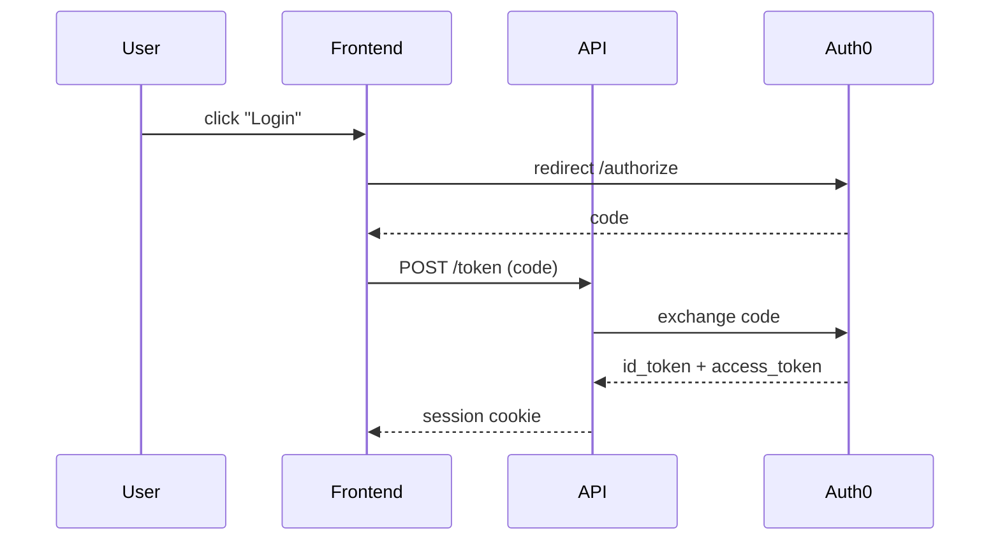

# 🏛️ Architecture Drawing — Mermaid Diagrams to Image

Render architecture / flow / sequence / ER / C4 diagrams from **Mermaid** source
into a sharable image (PNG / SVG / PDF) using the Mermaid CLI (`mmdc`), then
share a public URL via `xpworkspace-file-share`. Optionally embed the image in a
Markdown report when the user asks for documentation rather than a raw image.

---

## When to Use

Trigger on any of:

- "Draw / sketch / diagram the architecture of X"
- "Render this mermaid as an image"
- "Visualize the flow / sequence / ERD of …"
- "Generate a system / component / deployment diagram"
- "Make a C4 / context / container diagram"

If the user only wants Mermaid source (no image) — just emit the fenced
` ```mermaid ` block in chat and skip the renderer.

---

## What This Skill Provides

| Asset | Path | Purpose |
|---|---|---|
| Helper script | `workspace/dev-knowledge/skills/code/architecture_drawing/render_diagram.sh` | Wraps `mmdc` with sandbox-safe defaults; auto-runs bootstrap |
| Bootstrap script | `workspace/dev-knowledge/skills/code/architecture_drawing/bootstrap.sh` | Idempotent auto-fix: installs/restores `mmdc`, `fontconfig`, fonts; snapshots `/etc/fonts` + `/usr/share/fonts` to PVC for fast cold-boot rehydrate |
| Puppeteer config | `workspace/dev-knowledge/skills/code/architecture_drawing/puppeteer.json` | `--no-sandbox` flags required inside the agent container |
| This skill | `workspace/dev-knowledge/skills/architecture_drawing.md` | Workflow, examples, gotchas |

---

## Prerequisites

**Just run `bootstrap.sh` — nothing else needed.**

```bash
workspace/dev-knowledge/skills/code/architecture_drawing/bootstrap.sh
```

The helper script (`render_diagram.sh`) calls bootstrap automatically before
every render, so manual invocation is only needed if you want to warm-up a
session or verify health. Bootstrap is idempotent (~270 ms on healthy
systems) and handles three install paths:

1. **mmdc missing** → `npm install -g @mermaid-js/mermaid-cli` (persists in
   the NPM PVC).
2. **Fonts missing + PVC snapshot exists** → rsync `/etc/fonts` and
   `/usr/share/fonts` from `/agent/data/.persist/apt/dirs/` (~3 s, no apt).
3. **Fonts missing + no PVC snapshot** → `apt-get install -y
   fontconfig fonts-dejavu-core` then snapshot to PVC (~8 s, one-time).

Manual install (only if you want to skip bootstrap):

```bash
npm install -g @mermaid-js/mermaid-cli
sudo apt-get update && sudo apt-get install -y --no-install-recommends \
  fontconfig fonts-dejavu-core
which mmdc && mmdc --version && fc-list | head -1
```

If `mmdc` is missing, the helper script exits 127 with a clear install hint.
No extra Chromium install needed — `mmdc` ships its own Chromium under
`~/.cache/puppeteer`. The agent container blocks the default sandbox, so the
helper always passes `--no-sandbox` via `puppeteer.json`. Don't "fix" this by
removing the flag — render will fail.

> ⚠️ **Fontconfig is mandatory.** Without `fontconfig` + at least one TTF
> family installed, `sequenceDiagram`, `classDiagram`, `gantt`, and other
> text-measurement-heavy renderers fail with `Error: svg element not in
> render tree`. `flowchart` survives but emits `translate(undefined, NaN)`
> warnings. **The helper script auto-detects this state and re-installs
> fontconfig + fonts-dejavu-core on the fly**, so manual intervention is
> only needed if the apt repos themselves are unreachable. The apt PVC
> occasionally drops `/etc/fonts/` even though `dpkg` thinks the package
> is installed — hence the self-heal.

---

## Standard Workflow

1. **Author the Mermaid source.** Pick the right diagram type for the request:
   - System / component / deployment → `flowchart` (LR or TB)
   - Request flow / API call chain → `sequenceDiagram`
   - Data model / schema → `erDiagram`
   - State machine → `stateDiagram-v2`
   - C4 model → `C4Context`, `C4Container`, `C4Component`
   - Timeline → `gantt` or `timeline`
2. **Save source** to `workspace/tmp/diagrams/<name>.mmd` (or pipe via stdin).
3. **Render** with the helper:
   ```bash
   workspace/dev-knowledge/skills/code/architecture_drawing/render_diagram.sh \
     -i workspace/tmp/diagrams/<name>.mmd \
     -o workspace/tmp/diagrams/<name>.png
   ```
   Output path is echoed on stdout; logs go to stderr.
4. **Share the image** — call `xpworkspace-file-share` with the relative path
   and return the URL to the user. Do NOT `xpworkspace-file-read` the binary.
5. **(Optional) Markdown report.** When the user asks for a document, write a
   markdown file in `workspace/tmp/diagrams/<name>.md` that embeds the image
   via its shareable URL plus the rendered Mermaid source as a code block, then
   share the markdown file too. Keep prose tight; the diagram does the talking.

---

## Helper Script Reference

```
render_diagram.sh -i <input.mmd|->  -o <output.png|svg|pdf>
                  [-t <theme>]      # default | dark | forest | neutral
                  [-b <background>] # white (default) | transparent | #RRGGBB
                  [-w <width>] [-H <height>]
                  [-s <scale>]      # default 2 (retina-ish)
                  [-c <mermaid-config.json>]
```

- `-i -` reads Mermaid source from stdin (handy for short inline diagrams).
- Output format is inferred from the `-o` extension: `.png`, `.svg`, `.pdf`.
- `-t dark -b transparent` is great for embedding in dark-themed docs.
- For very wide system diagrams, prefer **SVG** (vector, no resolution loss)
  and a `flowchart LR` orientation.

---

## Examples

### 1. Quick flowchart from stdin → PNG

```bash
echo 'flowchart LR
  Client --> API
  API --> DB[(Postgres)]
  API --> Cache[(Redis)]' | \
  workspace/dev-knowledge/skills/code/architecture_drawing/render_diagram.sh \
    -i - -o workspace/tmp/diagrams/quick.png
```

### 2. C4 container diagram → SVG with dark theme

```bash
workspace/dev-knowledge/skills/code/architecture_drawing/render_diagram.sh \
  -i workspace/tmp/diagrams/xpander_c4.mmd \
  -o workspace/tmp/diagrams/xpander_c4.svg \
  -t dark -b transparent
```

### 3. Sequence diagram embedded in a Markdown brief

```markdown
# Auth Flow



```

---

## Output Locations & Cleanup

- All generated artifacts live under `workspace/tmp/diagrams/` (disposable).
- Never write rendered images into `workspace/dev-knowledge/skills/`, `workspace/dev-knowledge/memory/`,
  or `workspace/local/` — those are persistent stores, not output sinks.
- After sharing, you may `rm` the local file. The CDN link returned by
  `xpworkspace-file-share` remains valid.

---

## Sharing the Image (DO THIS)

```text
# After render returns the path:
xpworkspace-file-share { "path": "workspace/tmp/diagrams/quick.png" }
# → returns a public URL — paste it into the user reply.
```

**Never** `xpworkspace-file-read` a PNG/SVG/PDF — it bloats context with
binary garbage. `file-share` returns the URL straight from the workspace.

---

## Common Gotchas

| Symptom | Cause | Fix |
|---|---|---|
| `Failed to launch the browser process … No usable sandbox!` | Container blocks Chromium sandbox | Helper already passes `--no-sandbox`; ensure you're calling the helper, not raw `mmdc` |
| `mmdc: command not found` | Mermaid CLI not installed | `npm install -g @mermaid-js/mermaid-cli` |
| `Error: svg element not in render tree` (sequence/class/gantt) | Missing fontconfig + fonts inside Chromium | `sudo apt-get install -y --no-install-recommends fontconfig fonts-dejavu-core` |
| Garbled labels with `<` `>` `&` | Mermaid parses HTML-ish chars | Wrap labels in quotes: `A["User<input>"]` |
| Diagram cut off / overflows | Default viewport too small | Pass `-w 2400 -H 1600` or render to SVG |
| Arrows look fuzzy in slides | Raster scaling | Render `-o name.svg` instead of PNG |
| Edges to nowhere in C4 | Wrong renderer | Use `C4Context` / `C4Container` headers, not `flowchart` |

---

## Quality Checklist Before Sharing

- [ ] Diagram type matches the user's intent (flow vs sequence vs ERD vs C4).
- [ ] Node labels are short and human-readable; no internal IDs leaked.
- [ ] Direction (`LR` / `TB`) chosen so the diagram fits a typical 16:9 view.
- [ ] Output exists at the path the helper echoed (`ls -la <path>`).
- [ ] `xpworkspace-file-share` URL was returned to the user.
- [ ] Source `.mmd` is preserved in `workspace/tmp/diagrams/` so the user can
      tweak and re-render without rebuilding from scratch.

---

## Update Policy

- Bump the helper script when adding new flags or changing defaults; keep this
  doc in sync the same commit.
- If a new diagram type becomes common (e.g., `quadrantChart`, `mindmap`),
  add a one-liner under **Standard Workflow → diagram types** and an example.
- This skill renders **only** Mermaid. For PlantUML / Graphviz, create a
  separate skill — don't overload this one.
