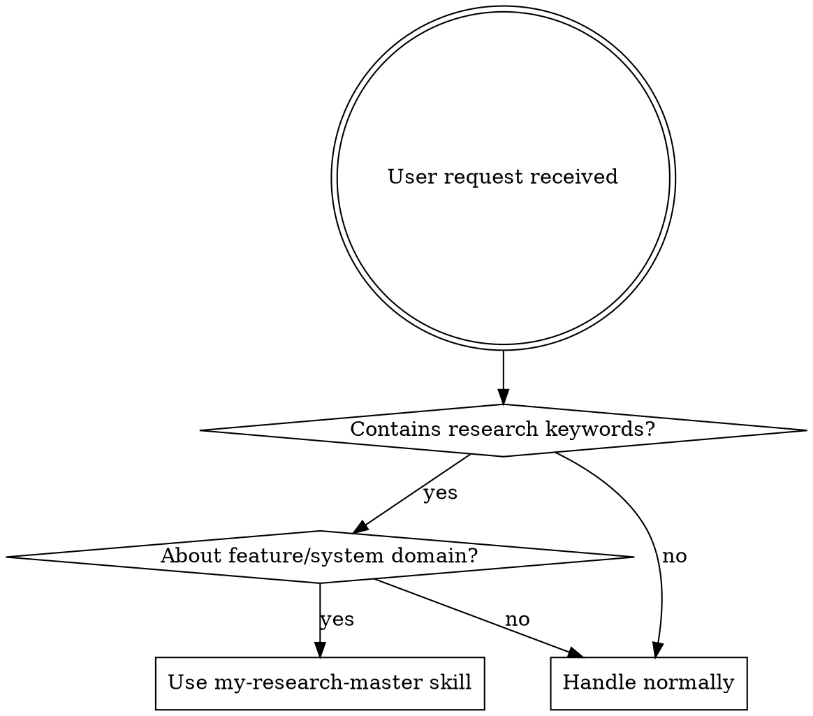
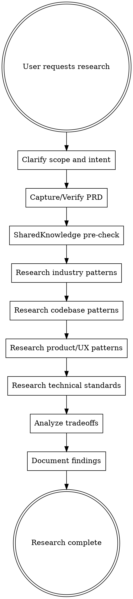
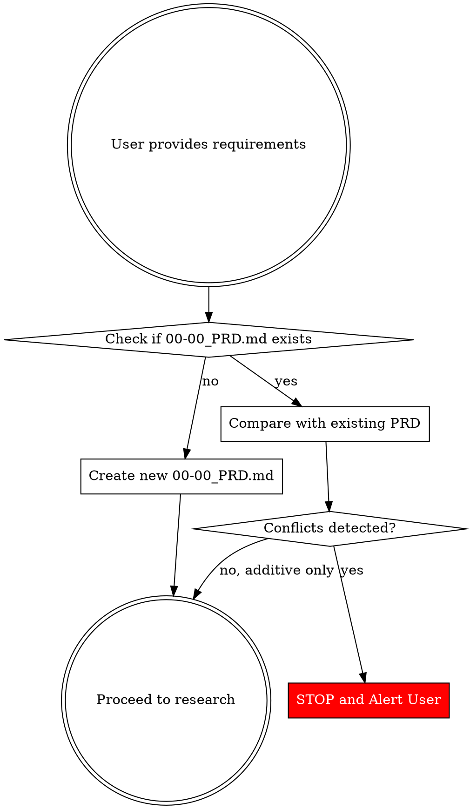

# Technical Feature Research

**Version:** 1.4.0

## Overview

Research is NOT implementation planning. Research is understanding how a problem domain works - both in the industry AND in the current codebase - before making implementation decisions.

**Core principle:** Teach the user how this type of problem is generally approached today, AND how their codebase currently handles similar problems, providing conceptual foundation for informed decisions later.

## The Iron Law

```
RESEARCH = NO IMPLEMENTATION SUGGESTIONS
RESEARCH = NO FEASIBILITY VERDICTS (no "yes you can" / "no you can't")
RESEARCH = ALWAYS DOCUMENTED
RESEARCH = INDUSTRY + CODEBASE PATTERNS (not one or the other)
RESEARCH = INFORMED BY SHARED KNOWLEDGE (patterns, lessons, guides, decisions)
RESEARCH = SAVED PROGRESSIVELY (write findings to disk after each step, not at the end)
```

If you're proposing solutions, giving implementation code, recommending specific approaches, or saying "yes/no it's possible," you're NOT doing research.

Delete all of it. Start over with pure research.

**No exceptions for:**
- Time pressure
- CEO requests
- Client demos
- "They just need yes/no"
- "Feasibility is different from research"

**All of these mean: Still do research. Document it. No shortcuts.**

## Research Includes TWO Domains

### 1. External Research (Industry)
- How the problem is solved across the industry
- Common patterns, protocols, specifications
- Libraries, frameworks, tools with tradeoffs
- UX patterns in popular products

### 2. Internal Research (Codebase)
- How similar problems are currently solved in THIS codebase
- Existing architectural patterns, conventions, utilities
- Where similar features live (directory structure)
- What patterns to follow for consistency

**CRITICAL DISTINCTION:**

| Codebase Analysis for RESEARCH (GOOD) | Codebase Analysis for FEASIBILITY (BAD) |
|---------------------------------------|----------------------------------------|
| "The codebase uses ReactiveStore pattern" | "Your code already does X, just enable it" |
| "Similar features are in src/features/" | "You're 90% done, wire up these components" |
| "WebSocket events use 33ms throttling" | "YES - this can be done by tomorrow" |
| "State sync follows pessimistic update pattern" | "Here's your implementation plan" |

**Codebase research = Understanding patterns for context**
**Feasibility analysis = Judging their code to give yes/no verdict**

## When to Use



**Triggers:**
- "Research how X works"
- "Investigate industry standards for Y"
- "How do other products handle Z"
- "What are best practices for W"
- "Is it possible to do X?" (feasibility = research, NOT verdict)
- "Can we implement Y?" (feasibility = research, NOT verdict)
- Before adding new features ("add collaborative editing" → research first)
- User explicitly says "research", "investigate", "explore"

**NOT for:**
- Debugging existing code
- Code review
- Specific implementation questions ("how do I use library X")
- Project-specific documentation

## Research Workflow



### Step 1: Clarify Scope and Intent (MANDATORY)

**STOP**: Before doing ANYTHING, check if this is actually a research request or a disguised feasibility/debugging request.

**If user asks "is it possible" or "can we do X":**

You MUST respond with:

"I'll research how [X] works in the industry AND how your codebase handles similar patterns - the technical approaches, protocols, and architectural patterns used to solve this problem. This will give you the foundation to assess feasibility yourself.

Before I start, I need to clarify scope:"

Then use **AskUserQuestion** to ask:
- What specific aspect needs research? (technical patterns, UX flows, protocols, architecture)
- What's the context? (adding new capability, understanding industry standards, evaluating approaches)
- Who's the audience? (technical team, executives, mixed)
- What decisions will this research inform?
- Are there multiple repos to investigate? (list paths if yes)

**NEVER start research without this clarification, even under time pressure.**

**No exceptions for:**
- "Request is obvious"
- "No time for questions"
- "Emergency situation"
- "CEO is waiting"
- "They just need yes/no"

**If you skip clarification, you WILL research the wrong thing.**

### Step 2: Capture/Verify PRD (CRITICAL)

When user provides requirements (PRD, spec, feature description, text, file), you MUST capture it as the source of truth.

**PRD Location:**
```
<main-repo>/docs/master/<timestamp>_<feature-name>/00-00_PRD.md
```

**Workflow:**



**If NO existing PRD:**
1. Create `00-00_PRD.md` in the feature directory
2. Preserve ALL details from the source (file, text, conversation)
3. Structure it cleanly but keep EVERY requirement, constraint, detail
4. Do NOT summarize or lose information

**If PRD ALREADY EXISTS and user provides new data:**

**STOP IMMEDIATELY** and use `AskUserQuestion`:

```
⚠️ ALERT: PRD Already Exists

I found an existing PRD at:
<path-to-existing-PRD>

You've provided new requirements that may conflict with or modify the existing PRD.

Detected changes:
- [List specific conflicts or additions]

What would you like to do?
```

**Options to present:**
1. **Merge (additive)** - Add new details without changing existing requirements
2. **Replace conflicting sections** - Update specific sections with new data
3. **Start fresh** - Replace entire PRD with new requirements
4. **Cancel** - Keep existing PRD, ignore new input

**NEVER silently merge or overwrite PRD data.**

**PRD Document Structure:**
```markdown
# PRD: [Feature Name]

**Created:** [timestamp]
**Last Updated:** [timestamp]
**Source:** [file path / conversation / user input]

## Overview
[High-level description of the feature]

## Requirements

### Functional Requirements
[What the feature must do]

### Non-Functional Requirements
[Performance, security, accessibility, etc.]

## Constraints
[Technical limitations, timeline, dependencies]

## User Stories / Use Cases
[If provided]

## Acceptance Criteria
[If provided]

## Out of Scope
[What this feature explicitly does NOT include]

## Open Questions
[Unresolved requirements needing clarification]

## Raw Source
[Original text/content exactly as provided - for reference]
```

**IMPORTANT:** The "Raw Source" section preserves the EXACT original input. Never lose this.

### Step 2b: SharedKnowledge Pre-Check (via Sub-Agent)

**Before starting external or codebase research, check what the team already knows.**

**Dispatch via `Agent` tool with `subagent_type: "sk-scout"`:**

```
Scan SharedKnowledge for content relevant to: [research topic].
```

The `sk-scout` agent definition handles all folder scanning, format, and constraints automatically (haiku, read-only, 8 SK folders, max 30 lines). This protects the main research context from unnecessary content.

**What this prevents:**
- Re-researching problems the team already solved
- Missing relevant patterns that should inform research scope
- Ignoring past lessons that shaped team conventions
- Researching in isolation from institutional knowledge

**Include findings in the research document** under "SharedKnowledge Findings" section.

### Step 3: Research Industry Patterns

**What to investigate:**
- How is this problem commonly solved in modern products?
- What are the standard approaches? (not "best", but "common")
- What protocols, specifications, or conventions exist?
- What are the established patterns in this domain?

**Sources to explore:**
- Web search for industry standards and specifications
- Documentation of popular frameworks/libraries in this space
- Academic papers or technical blog posts from experts
- Official protocol specifications (RFC, W3C, etc.)

**Use:**
- `WebSearch` for current standards
- `WebFetch` for specific documentation
- `mcp__plugin_context7_context7__resolve-library-id` + `query-docs` for library docs

### Step 4: Research Codebase Patterns

**What to investigate:**
- How does THIS codebase handle similar problems?
- What architectural patterns are established?
- Where do similar features live? (directory structure, conventions)
- What utilities, stores, services already exist?
- What patterns should be followed for consistency?

**Multi-repo support:** If project has multiple repos (frontend, backend, services), investigate ALL relevant repos from the current folder structure.

**Use:**
- `Task` tool with `Explore` agent (set thoroughness based on scope)
- `Grep` for finding existing patterns
- `Read` for understanding specific implementations
- `Glob` for discovering file structure

**REMEMBER:** You're documenting PATTERNS, not giving verdicts.

```markdown
✅ GOOD: "The codebase uses ReactiveStore pattern (src/stores/) for feature-specific state.
Similar real-time features use WebSocket events via SpatialWebsocketV2 with 33ms throttling.
Collaboration features are in src/features/space/components/CollaborationRoom/."

❌ BAD: "Your code already has 90% of what you need. Just enable cursors in SpatialRoom
like CollaborationRoom does. Here's the implementation..."
```

### Step 5: Research Product/UX Patterns

**What to investigate:**
- How do users interact with this feature in popular products?
- What are common UX patterns? (not just technical implementation)
- What flows and interactions are standard?
- What edge cases do products handle?

**Sources:**
- Popular products in the space (Google Docs, Figma, Notion, etc.)
- UX case studies and design patterns
- User experience articles and reviews

### Step 6: Research Technical Standards

**What to investigate:**
- Frontend state management patterns for this problem
- Common libraries, packages, utilities (with tradeoffs)
- Framework-level capabilities
- Language and typing considerations
- Architectural patterns and mechanics

**Sources:**
- Library documentation (use Context7 tools)
- Framework guides
- Architecture discussions and comparisons

### Step 7: Analyze Tradeoffs

**Critical section - don't skip:**
- When to use approach A vs B vs C?
- What are the failure modes and edge cases?
- Common pitfalls in this domain
- When NOT to use certain approaches
- Performance, complexity, maintainability tradeoffs
- How industry patterns align or conflict with codebase patterns

**This is where experience matters** - surface the non-obvious decisions.

### Step 8: Document Findings

**Create file at:**
```
<main-repo>/docs/master/<timestamp>_<feature-name>/10-00_RESEARCH.md
```

**Path rules:**
- `<main-repo>`: Frontend repo if multi-repo project, otherwise current repo
- `<timestamp>`: YYYYMMDD_HHMM format
- `<feature-name>`: Kebab-case, descriptive (e.g., "collaborative-editing")
- `10-00_RESEARCH.md`: Part of numbered sequence (20-05___DESIGN.md, 30-00_IMPLEMENTATION-SUMMARY.md may follow)

**Structure:**
```markdown
# Research: [Feature Name]

## Research Context
- What was researched
- Why this research was needed
- Scope and boundaries
- Repos investigated

## SharedKnowledge Findings
- Relevant patterns found (or "none")
- Relevant lessons found (or "none")
- Applicable standards loaded
- Applicable guides referenced
- Prior ADRs that informed this research (or "none")

## Industry Standards and Patterns
- How this problem is commonly solved
- Established protocols and specifications
- Common architectural patterns

## Existing Codebase Patterns
- How similar problems are currently solved in this codebase
- Relevant directories, files, utilities
- Architectural patterns already in use
- Conventions to follow for consistency
- Multi-repo considerations (if applicable)

## Product/UX Patterns
- How popular products handle this
- Common user flows and interactions
- UX patterns and conventions

## Technical Implementation Patterns
- State management approaches
- Common libraries and tools (with tradeoffs)
- Framework capabilities
- Architecture patterns

## Tradeoffs and Decision Points
- When to use approach A vs B
- Common pitfalls and edge cases
- Performance vs complexity tradeoffs
- When NOT to use certain approaches
- Industry vs codebase pattern alignment

## Repository Architecture Considerations
- Where new code should live (separation of concerns)
- How this affects existing structure
- Reusability and maintainability implications

## Open Questions
- What still needs investigation
- Decisions that need user input
- Areas requiring deeper research

## Sources
- [All URLs and references used]
- [Codebase files referenced]
```

## Research vs Feasibility Analysis

**Users will often ask feasibility questions that SOUND different from research:**
- "Is it possible to add X?"
- "Can we do Y by tomorrow?"
- "Is Z feasible with our stack?"

**CRITICAL**: These are still research questions. The difference:

| Feasibility Analysis (WRONG) | Research (CORRECT) |
|------------------------------|-------------------|
| "YES - your code already does X" | "Industry uses approaches A, B, C for X" |
| "NO - would take 6 hours" | "X requires capabilities: state sync, conflict resolution" |
| "You have 90% of what you need" | "Codebase pattern: ReactiveStore for state, WebSocket for sync" |
| "Just wire up these components" | "Similar features in codebase follow this directory structure..." |

**Feasibility = judging THEIR code to give yes/no verdict**
**Research = understanding BOTH industry AND codebase patterns to inform decisions**

When user asks "is it possible," research industry patterns AND codebase patterns so THEY can assess feasibility themselves.

## Red Flags - STOP and Restart

These thoughts mean you're NOT doing research:

| Thought | Reality |
|---------|---------|
| "Here's how to implement this" | Research doesn't include implementation. Delete and restart. |
| "I recommend using library X" | Research explains options, not recommendations. Delete and restart. |
| "Your current code already does Y" | Research documents patterns, doesn't give verdicts. Delete and restart. |
| "Quick wins you can do" | Research doesn't include action items. Delete and restart. |
| "Here's sample code to add" | Research is conceptual, not implementation code. Delete and restart. |
| "Just provide the answer inline" | Research must be documented. Delete and restart. |
| "Skip basics since they have code" | Research starts with fundamentals. Delete and restart. |
| "They need this fast, skip docs" | Fast research still needs documentation. Delete and restart. |
| "They need yes/no answer" | Research informs the decision, doesn't make it. Delete and restart. |
| "This is feasibility, not research" | Feasibility questions need research. Delete and restart. |
| "CEO needs answer NOW" | Authority doesn't change process. Delete and restart. |
| "Just enable this existing feature" | That's implementation advice, not research. Delete and restart. |
| "Skip codebase, just do web research" | Research includes BOTH. Delete and restart. |
| "Skip web, just analyze their code" | Research includes BOTH. Delete and restart. |
| "I'll write the research doc at the end" | Save progressively after each step. Context can die anytime. |

**All of these mean: You're in implementation/analysis mode. Stop. Go back to research mode.**

## What NOT To Do - Explicit Examples

### WRONG: Feasibility Verdict Disguised as Research

```markdown
❌ COMPLETELY WRONG:
User: "Can we add collaborative cursors by tomorrow?"
You: "YES - your code already has cursors in CollaborationRoomStore..."
[Gives implementation timeline]
[Recommends Option A vs Option B]
[Says "YES we can do it"]
```

### WRONG: Web-Only Research (Missing Codebase)

```markdown
❌ INCOMPLETE:
User: "Research collaborative cursors"
You: [Only does web search]
[Documents industry patterns]
[Never looks at the actual codebase]
[Misses existing patterns and conventions]
```

### CORRECT: Full Research (Industry + Codebase)

```markdown
✅ CORRECT:
User: "Can we add collaborative cursors by tomorrow?"
You: "I'll research collaborative cursor patterns in the industry AND how your codebase handles similar features. First, let me clarify scope:"
[Uses AskUserQuestion]
[After answers, creates research document with:]

INDUSTRY PATTERNS:
- How collaborative cursors work (WebSocket vs WebRTC data channels)
- Industry patterns (throttling rates, cursor types, viewport sync)
- Protocol considerations (update frequency, latency, bandwidth)
- UX patterns (cursor colors, names, animations)
- Common pitfalls (race conditions, cursor jumping)

CODEBASE PATTERNS:
- State management: ReactiveStore pattern in src/stores/
- Real-time sync: WebSocket via SpatialWebsocketV2, 33ms throttling
- Similar features: CollaborationRoom has cursor rendering in RemoteMemberCursor.vue
- Directory structure: Features in src/features/, components in src/components/
- Conventions: IoC container for services, composables in src/hooks/

[User reads research and THEY determine feasibility]
```

## Execution Tools

**For web research:**
- `WebSearch` for current standards, comparisons, best practices
- `WebFetch` for specific documentation pages
- `mcp__plugin_context7_context7__resolve-library-id` + `query-docs` for library research

**For codebase research:**
- `Task` tool with `Explore` agent for multi-file pattern investigation
- `Grep` for finding existing patterns across repos
- `Read` for understanding specific implementations
- `Glob` for discovering file structure

**For SharedKnowledge pre-check (Step 2b):**
- `Agent` tool with `subagent_type: "sk-scout"` — defined in `~/.claude/agents/sk-scout.md`
- Scans all SK folders (patterns/, lessons/, standards/, guides/, decisions/, runbooks/, preferences/)
- Returns concise relevance summary to main context (max 30 lines)

**For deep/complex research:**
- `Task` tool with `general-purpose` agent for complex multi-source research
- **Use `model: "opus"` for deep technical research requiring synthesis**
- Dispatch parallel agents for independent research areas

**Multi-repo investigation:**
- Check parent directories for sibling repos
- Use `Glob` and `Grep` across multiple repo roots
- Document which repos contain which patterns

**Never use (during research phase):**
- `Edit` or `Write` to modify code
- `EnterPlanMode` for implementation planning
- Implementation-focused tools

## Session Continuity (Progressive Save)

**Problem:** Deep research sessions — especially multi-repo codebase exploration + extensive web research — can exhaust context before the research document is written. If you only write `10-00_RESEARCH.md` at the end (Step 8), ALL research is lost.

**Solution:** Write the research file progressively — after each step, not just at the end.

### Progressive Save Protocol

| After Step | What to Write to Disk |
|-----------|----------------------|
| Step 2 (PRD capture) | Create `10-00_RESEARCH.md` with metadata + research scope |
| Step 2b (SK pre-check) | Add SharedKnowledge Findings section |
| Step 3 (Industry) | Add Industry Standards section |
| Step 4 (Codebase) | Add Codebase Patterns section |
| Step 5 (UX) | Add Product/UX Patterns section |
| Step 6 (Technical) | Add Technical Implementation section |
| Step 7 (Tradeoffs) | Add Tradeoffs section |
| Step 8 (Final) | Add Open Questions, clean up, add Sources |

### Research Resume State Header

At the **top** of `10-00_RESEARCH.md`, maintain a resume state block (updated after each step):

```markdown
<!-- RESEARCH RESUME STATE
research_skill_version: 1.4.0
current_step: [Step N: Name]
steps_completed: [2, 2b, 3, 4]
steps_remaining: [5, 6, 7, 8]
repos_investigated: [list of repo paths]
web_searches_done: [N]
last_updated: [YYYY-MM-DD HH:MM]
context_note: [brief state description for new session]
-->
```

### Standalone Resume File: `10-99___RESUME_STATE.md`

In addition to the inline resume header, **also maintain a standalone resume file** at:

```
<project_root>/docs/master/<timestamp>_<task>/10-99___RESUME_STATE.md
```

This file follows the `10-xx` prefix convention (research artifacts = `10-*`). Same pattern across all pipeline skills:

| Skill | Resume File |
|-------|------------|
| Research | `10-99___RESUME_STATE.md` |
| Planning | `20-99___RESUME_STATE.md` |
| Orchestration | `30-99___RESUME_PROMPT.md` |

### How It Works

1. **After each research step** → Write findings to the appropriate section of `10-00_RESEARCH.md`
2. **Update resume header** → Reflect current step and what's done/remaining
3. **Update `10-99___RESUME_STATE.md`** → Standalone resume file with current state
4. **Sections not yet researched** → Leave placeholder: `## [Section Name]\n_Not yet researched._`
5. **If context dies** → Files on disk have everything researched so far + clear indication of what's remaining

### If Context Dies Mid-Research

**What's on disk:**
- `10-99___RESUME_STATE.md` — standalone resume file (easy to find)
- `10-00_RESEARCH.md` — partially-complete research with inline resume header + all findings so far

**What the user does:**
1. Exit dead session
2. Start new `claude` session
3. Say: **"Continue research from `[path]/10-99___RESUME_STATE.md`"**
4. New session reads the resume file, then the research doc, continues from next step
5. New session invokes `/my-research-master` and skips completed steps

### Context Threshold Monitoring

**These thresholds are unified across all pipeline skills and adapt to model context size.**

**For 1M context models (Opus 4.6 1M):**

| Context Level | Action |
|--------------|--------|
| ~200k tokens | 🟡 Ensure research file + `10-99___RESUME_STATE.md` saved with latest findings |
| ~300k tokens | 🔴 Finalize both files, **print alert message to user** (see below) |
| ~350k tokens | 💀 Stop research, save everything, **print emergency message then STOP** |

**Fallback for 200k context models (Sonnet, Haiku):**

| Context Level | Action |
|--------------|--------|
| ~100k tokens | 🟡 Ensure research file + `10-99___RESUME_STATE.md` saved with latest findings |
| ~140k tokens | 🔴 Finalize both files, **print alert message to user** |
| ~155k tokens | 💀 Stop research, save everything, **print emergency message then STOP** |

**Model check:** Verify model is Opus 4.6 (1M) via statusline (`🤖 Opus 4.6 (1M)`) or model ID before using the 1M thresholds.

### User Alert Messages (MUST print to terminal)

**CRITICAL RULE: The alert MUST be the ABSOLUTE LAST output of the conversation.**
When you detect context is at ~85%+, save all files, then print the alert as your FINAL message.
Do NOT output anything after the alert — no "let me continue", no tool calls, no summaries.
The user will scroll up in the dead terminal and the copy-paste instructions must be right there.

**At ~300k tokens (1M model) / ~140k (200k model) — save files, then print this as your LAST message (fill in `<PATH>`):**

```
============================================================
  🔴 CONTEXT HIGH (~300k) — RESEARCH SESSION CONTINUITY ACTIVATED
============================================================

Resume files saved to:
  <PATH>/10-99___RESUME_STATE.md
  <PATH>/10-00_RESEARCH.md

When this session can no longer respond:

  1. Exit:  Ctrl+C or close terminal
  2. Start: claude
  3. Paste the following into the new session:

     Continue an in-progress research session.
     Read: <PATH>/10-99___RESUME_STATE.md
     Read: <PATH>/10-00_RESEARCH.md
     After reading, invoke /my-research-master and skip completed steps.
     Continue from the first incomplete section.

Full guide: C:\Projects\SharedKnowledge\guides\session-continuity-guide.md
============================================================
```

**At ~350k tokens (1M model) / ~155k (200k model) — save files, then print this as your ABSOLUTE FINAL output, then STOP:**

```
!!!!!!!!!!!!!!!!!!!!!!!!!!!!!!!!!!!!!!!!!!!!!!!!!!!!!!!!!!!!!
  💀 CONTEXT CRITICAL (~350k) — STOPPING RESEARCH SESSION
!!!!!!!!!!!!!!!!!!!!!!!!!!!!!!!!!!!!!!!!!!!!!!!!!!!!!!!!!!!!!

Resume files saved to:
  <PATH>/10-99___RESUME_STATE.md
  <PATH>/10-00_RESEARCH.md

EXIT NOW and resume in a new session:

  1. Exit:  Ctrl+C
  2. Start: claude
  3. Paste:
     Continue research from <PATH>/10-99___RESUME_STATE.md

!!!!!!!!!!!!!!!!!!!!!!!!!!!!!!!!!!!!!!!!!!!!!!!!!!!!!!!!!!!!!
```

**After printing either alert: OUTPUT NOTHING. The alert IS your final message.**

---

## After Research is Complete

### Step 8b: SharedKnowledge Write-Back (if applicable)

**If the research revealed learnings that benefit the team's institutional knowledge, write them back.**

**When to write back (any of these):**
- Research uncovered a pitfall or lesson not already in `lessons/`
- Research identified a reusable pattern not already in `patterns/`
- Research findings suggest a new guide would help future researchers

**How to write back:**
- Spawn a sub-agent to create/update the relevant SharedKnowledge files
- Update the appropriate INDEX.md
- Keep entries concise — research write-backs are typically 5-15 lines

**When NOT to write back:**
- All findings are project-specific (not reusable by other projects)
- SharedKnowledge already covers the topic adequately
- Research was inconclusive or exploratory

### Tell the user:
```
Research complete. Findings documented at:
<path-to-research-file>

This research covers:
- Industry patterns for [feature]
- Existing codebase patterns in [repos investigated]
- SharedKnowledge context applied (patterns, lessons, guides, decisions)
- Tradeoffs and decision points

SharedKnowledge write-back: [Yes - added lesson/pattern to SK | No - findings are project-specific]

Next steps could include:
- Reviewing research findings
- Using /brainstorming to explore implementation approaches
- Using /writing-plans to create implementation plan
```

**Don't automatically move to implementation** - let user decide next steps.

## Real-World Impact

**Research-first approach prevents:**
- Reinventing solved problems poorly
- Ignoring existing codebase patterns (inconsistency)
- Choosing wrong patterns for the problem
- Missing critical edge cases
- Making uninformed architectural decisions
- Technical debt from "just making it work"

**Research enables:**
- Informed technology choices
- Consistency with existing codebase patterns
- Understanding tradeoffs before committing
- Learning from industry experience
- Spotting pitfalls before hitting them
- Better architecture from the start
