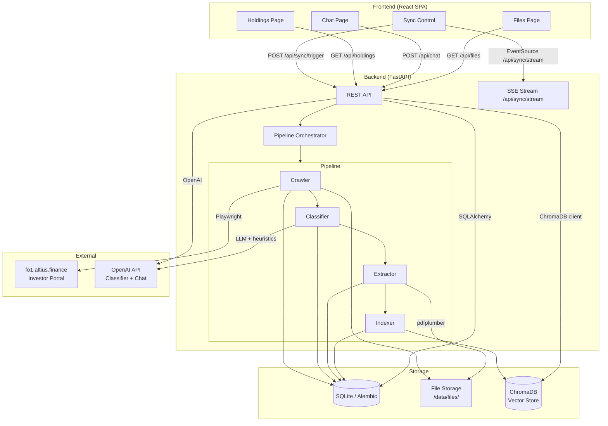

# Design Document: Investor Document Platform

## Overview

The Investor Document Platform automates the full lifecycle of pulling investment documents from
the family-office investor portal at `fo1.altius.finance`, classifying and structurally extracting
data from those documents, and surfacing the results through a web frontend.

The system is composed of five major subsystems that run sequentially in a pipeline:

1. **Crawler** — Authenticates with the portal and downloads every new file
2. **Classifier** — Labels each file as `capital_account_statement`, `report`, or `other`
3. **Extractor** — Pulls structured fields from capital account statements
4. **Indexer** — Embeds and stores documents in a vector store for RAG retrieval
5. **Frontend** — React SPA with a Holdings page, Chat page, Files page, and sync control

The backend is a Python FastAPI server that orchestrates the pipeline, serves a REST API, and
streams live pipeline progress to the frontend via Server-Sent Events (SSE).

### Technology Choices and Rationale

| Layer | Choice | Rationale |
|---|---|---|
| Backend framework | FastAPI | Async-native, SSE support via `StreamingResponse`, strong typing with Pydantic, fast iteration |
| Browser automation | Playwright (async) | More reliable than Selenium on modern SPAs; built-in network interception for download capture; easier CI setup than Selenium; context managers avoid resource leaks |
| PDF parsing | pdfplumber | Best-in-class table extraction (needed for CAS); falls back to raw text; open source; no external service call |
| LLM provider | OpenAI (gpt-4o-mini for classifier, gpt-4o for chat) | Cost-effective classification; high-quality RAG answer synthesis |
| Vector store | ChromaDB (local persistent) | No infrastructure dependency; embedded in process; persistent across restarts; easy to replace |
| Embeddings | OpenAI text-embedding-3-small | Good quality/cost ratio; consistent with LLM provider |
| Database | SQLite with SQLAlchemy + Alembic | Zero infrastructure for a single-instance app; Alembic handles migrations; easy to swap to Postgres |
| Frontend framework | React + TypeScript + Vite | Standard SPA toolchain; TypeScript catches API contract bugs |
| Frontend styling | Tailwind CSS | Sufficient for a functional UI without design overhead |
| HTTP client (frontend) | fetch API + EventSource | Native browser APIs; no extra dependency for SSE |


---

## Architecture

### High-Level System Diagram



### Request Flow: Sync

```
Browser  →  POST /api/sync/trigger  →  FastAPI
                                         ↓
                               Check: pipeline running?
                               Yes → 409 Conflict
                               No  → Start background task
                                         ↓
Browser  ←→  EventSource /api/sync/stream  (SSE)
                  ← {stage: "Crawling", progress: ...}
                  ← {stage: "Classifying", ...}
                  ← {stage: "Extracting", ...}
                  ← {stage: "Indexing", ...}
                  ← {type: "complete", summary: {...}}
                  ← Connection closed
```

### Request Flow: Chat

```
Browser  →  POST /api/chat  →  FastAPI
                                  ↓
                        Embed question (OpenAI)
                                  ↓
                        ChromaDB.query(top_k=20)
                                  ↓
                        Build prompt with passages + citations
                                  ↓
                        OpenAI gpt-4o chat completion
                                  ↓
Browser  ←  {answer, citations: [{file_name, period, file_url}]}
```


---

## Components and Interfaces

### 1. Crawler

**Module:** `backend/crawler/portal_crawler.py`

The crawler drives a headless Chromium browser via Playwright. It authenticates, enumerates
deals and files from the portal's deal index, and downloads files to the local filesystem.

```python
class PortalCrawler:
    async def run(self, progress_callback: Callable[[CrawlProgress], None]) -> CrawlResult
    async def _login(self) -> None
    async def _enumerate_deals(self) -> list[DealInfo]
    async def _enumerate_files(self, deal: DealInfo) -> list[FileInfo]
    async def _download_file(self, file_info: FileInfo) -> Path
```

**Key design decisions:**

- Credentials are read from `settings.PORTAL_USERNAME` / `settings.PORTAL_PASSWORD` (env vars only).
- Before each download, the crawler queries the DB for an existing record with matching
  `(portal_url, file_name)`; skips if status is `downloaded` or `extracted`; retries if `failed`.
- Session expiry is detected by watching for a redirect to the login page during navigation.
  Retry logic re-runs `_login()` up to 3 times and resumes from the in-progress deal index.
- All deal names, file names, and portal URLs are recorded to DB before any download begins
  (satisfying Requirement 2.3 and 2.5).

**Progress events emitted:**
```
{stage: "Crawling", event: "deal_discovered", deal_name: str}
{stage: "Crawling", event: "file_downloaded", file_name: str}
{stage: "Crawling", event: "file_skipped", file_name: str, reason: str}
{stage: "Crawling", event: "error", message: str}
```

---

### 2. Classifier

**Module:** `backend/classifier/document_classifier.py`

The classifier uses a hybrid approach: first a fast heuristic pass based on filename and document
structure cues, then an LLM call (gpt-4o-mini) with the first ~2000 characters of extracted text
for ambiguous cases.

```python
class DocumentClassifier:
    async def classify(self, file_record: FileRecord) -> ClassificationResult
    def _heuristic_classify(self, text: str, filename: str) -> ClassificationResult | None
    async def _llm_classify(self, text: str, filename: str) -> ClassificationResult

@dataclass
class ClassificationResult:
    label: Literal["capital_account_statement", "report", "other"]
    confidence: float  # [0.0, 1.0]
    method: Literal["heuristic", "llm", "failed"]
    reason: str
```

**Heuristic rules (applied first, returns early if confidence ≥ 0.90):**
- Filename contains "capital account", "CAS", "statement" → likely `capital_account_statement`
- Filename contains "report", "quarterly", "update", "letter" → likely `report`
- Document contains structured table rows with "committed", "contributed", "distributed" labels
  within first 3 pages → `capital_account_statement` with high confidence

**LLM prompt strategy:**
- System prompt: role definition + label descriptions
- User prompt: filename + first 2000 chars of extracted text
- Output: JSON `{label, confidence, reasoning}`
- Temperature: 0.0 for determinism

**Skip logic:** Before classifying, check DB for existing label (any non-null label including
`unclassified`). Skip if already classified (Requirement 4.8).

---

### 3. Extractor

**Module:** `backend/extractor/statement_extractor.py`

The extractor parses capital account statement PDFs using pdfplumber and applies regex + LLM
hybrid logic to locate fund name, statement date, and current value.

```python
class StatementExtractor:
    def extract(self, file_path: Path, file_record: FileRecord) -> ExtractionResult

    def _parse_pdf(self, path: Path) -> list[PageContent]
    def _extract_fund_name(self, pages: list[PageContent]) -> str | None
    def _extract_statement_date(self, pages: list[PageContent]) -> date | None
    def _extract_current_value(self, pages: list[PageContent]) -> Decimal | None

@dataclass
class PageContent:
    page_number: int
    text: str
    tables: list[list[list[str | None]]]  # pdfplumber table rows

@dataclass
class ExtractionResult:
    success: bool
    fund_name: str | None
    statement_date: date | None       # ISO 8601 stored in DB
    current_value: Decimal | None
    failure_reason: str | None
```

**Current value field detection (Requirement 5.2):**

The extractor searches all table cells and text paragraphs for rows matching known variant labels
(case-insensitive, whitespace-normalized):
- "ending capital balance"
- "closing nav"
- "partner's capital — ending"
- "partner's capital - ending"
- "net asset value"
- "ending balance"
- "closing balance"
- "partners' capital, end of period"

When a matching label is found, the adjacent numeric value (right column in tables, or right-
justified number on the same line) is parsed after stripping currency symbols and commas.

**Atomicity (Requirements 5.3, 5.4, 10.5):**
Extraction is all-or-nothing. If any required field is missing or unparseable, no partial data
is written to the `statements` table. A failure record is written to the `files` table only.

---

### 4. Indexer

**Module:** `backend/indexer/document_indexer.py`

The indexer processes downloaded PDFs (reports + capital account statements) into ChromaDB for
RAG retrieval.

```python
class DocumentIndexer:
    async def index_file(self, file_record: FileRecord) -> None
    async def index_all_pending(self, progress_callback: Callable) -> IndexResult

    def _chunk_text(self, text: str, chunk_size: int = 800,
                    overlap: int = 100) -> list[str]
```

**Chunking strategy:** Sliding window with 800-token chunks and 100-token overlap. Chunk boundaries
prefer paragraph breaks. Each chunk stores metadata: `file_id`, `file_name`, `deal_name`,
`document_type`, `statement_date` (for statements), `chunk_index`.

**Embedding:** OpenAI `text-embedding-3-small` (1536 dimensions). Batched in groups of 100 to
respect API rate limits.

**ChromaDB collection:** Single collection named `investor_documents`. Documents are identified
by `{file_id}_{chunk_index}` to allow idempotent upsert on re-index.

---

### 5. FastAPI Application

**Module:** `backend/api/`

```
backend/api/
├── main.py              # App factory, lifespan, middleware
├── routers/
│   ├── sync.py          # POST /api/sync/trigger, GET /api/sync/stream
│   ├── holdings.py      # GET /api/holdings
│   ├── chat.py          # POST /api/chat
│   └── files.py         # GET /api/files, GET /api/files/{id}/download
├── dependencies.py      # DB session, settings injection
└── schemas.py           # Pydantic request/response models
```

**API Endpoints:**

| Method | Path | Description |
|---|---|---|
| `POST` | `/api/sync/trigger` | Start pipeline; returns 409 if already running |
| `GET` | `/api/sync/stream` | SSE stream of pipeline progress events |
| `GET` | `/api/holdings` | Returns latest statement per fund |
| `POST` | `/api/chat` | Submit question; returns answer + citations |
| `GET` | `/api/files` | List all files with metadata |
| `GET` | `/api/files/{id}/download` | Stream file bytes to browser |

**Concurrency guard (Requirement 6.6):**
A module-level `asyncio.Lock` and a boolean flag `_pipeline_running` prevent concurrent runs.
The flag is set atomically at pipeline start and cleared in a `finally` block.

**SSE implementation:**
The `/api/sync/stream` endpoint uses FastAPI's `StreamingResponse` with an `asyncio.Queue`.
The pipeline writes progress events to the queue; the stream generator reads and formats them
as `data: {json}\n\n` events. The connection is held open until the pipeline emits a `complete`
or `error` terminal event, then closed.


---

### 6. Frontend (React SPA)

**Module:** `frontend/src/`

```
frontend/src/
├── App.tsx               # Router setup
├── components/
│   ├── SyncControl.tsx   # Global sync button + status
│   └── Layout.tsx        # Shell with nav + sync control
├── pages/
│   ├── HoldingsPage.tsx
│   ├── ChatPage.tsx
│   └── FilesPage.tsx
├── hooks/
│   ├── useSyncStream.ts  # SSE connection, pipeline state
│   └── useHoldings.ts
├── api/
│   └── client.ts         # Typed API wrappers
└── types/
    └── index.ts          # Shared TypeScript types
```

**Sync control behavior:**
- Lives in `Layout.tsx`, visible on all pages via the top nav
- On click: `POST /api/sync/trigger`, disable button, open `EventSource` to `/api/sync/stream`
- Progress events update a status string ("Crawling…", "Classifying…", etc.)
- Terminal `complete` event triggers Holdings page data refresh; button re-enabled
- Terminal `error` event displays error message; button re-enabled
- If `POST` returns 409, show "Sync already in progress" inline without disabling button

**Holdings page:**
- On mount: `GET /api/holdings`
- Refreshes automatically when sync `complete` event fires via a shared React context
- Empty state shows a CTA to run sync
- Failed extractions show "—" placeholder in the value cell

**Chat page:**
- Uncontrolled textarea; submits on Enter (Shift+Enter for newline) or button
- Sends `POST /api/chat` with `{question: string}`
- Displays streaming-style loading indicator
- Renders answer with inline citation chips; each chip links to `/api/files/{id}/download`
- 60-second client timeout with "Request timed out" error display and retry option

**Files page:**
- Default sort: download_date descending
- Low-confidence badge: amber pill "Low confidence" on rows with confidence < 0.75
- Column sort on "Document Type" column header
- "Open" button opens `/api/files/{id}/download` in a new tab

---

## Data Models

### Database Schema (SQLAlchemy / SQLite)

```sql
-- files: tracks every discovered file through its lifecycle
CREATE TABLE files (
    id               INTEGER PRIMARY KEY AUTOINCREMENT,
    portal_url       TEXT NOT NULL,
    deal_name        TEXT NOT NULL,
    file_name        TEXT NOT NULL,
    local_path       TEXT,
    download_ts      TEXT,           -- ISO 8601 UTC
    status           TEXT NOT NULL   -- pending | downloaded | extracted | failed
                     CHECK(status IN ('pending','downloaded','extracted','failed')),
    classification   TEXT,           -- capital_account_statement | report | other | unclassified
    confidence       REAL,           -- [0.0, 1.0]
    low_confidence   INTEGER,        -- 0 | 1 (boolean)
    extraction_error TEXT,
    indexed          INTEGER NOT NULL DEFAULT 0,  -- 0 | 1
    created_at       TEXT NOT NULL DEFAULT (datetime('now')),
    UNIQUE(portal_url, file_name)    -- prevents duplicate records (Req 11.3)
);

-- statements: extracted structured data from capital account statements
CREATE TABLE statements (
    id             INTEGER PRIMARY KEY AUTOINCREMENT,
    file_id        INTEGER NOT NULL REFERENCES files(id) ON DELETE CASCADE,
    fund_name      TEXT NOT NULL,
    statement_date TEXT NOT NULL,   -- ISO 8601 date (YYYY-MM-DD)
    current_value  TEXT NOT NULL    -- stored as TEXT to preserve decimal precision
);

CREATE INDEX idx_statements_fund_date
    ON statements(fund_name, statement_date);
```

**Latest statement per fund query (Requirement 11.4 / 5.6):**
```sql
SELECT s.*
FROM statements s
INNER JOIN (
    SELECT
        lower(trim(fund_name))         AS norm_fund,
        MAX(statement_date)            AS max_date,
        MAX(id)                        AS max_id   -- tie-breaker: highest file_id
    FROM statements
    GROUP BY lower(trim(fund_name))
) latest
    ON lower(trim(s.fund_name)) = latest.norm_fund
    AND s.statement_date = latest.max_date
    AND s.id = latest.max_id;
```

### Pydantic API Schemas

```python
# GET /api/holdings response
class HoldingRow(BaseModel):
    fund_name: str
    current_value: str          # formatted: "$1,234,567.89"
    statement_date: str         # formatted: "March 31, 2025"
    file_id: int

class HoldingsResponse(BaseModel):
    holdings: list[HoldingRow]

# POST /api/chat request / response
class ChatRequest(BaseModel):
    question: str

class Citation(BaseModel):
    file_name: str
    period: str                 # e.g. "Q1 2025" or statement date
    file_url: str               # /api/files/{id}/download

class ChatResponse(BaseModel):
    answer: str
    citations: list[Citation]
    not_found: bool             # True when LLM found no supporting passages

# SSE event payload
class SyncProgressEvent(BaseModel):
    stage: Literal["Crawling", "Classifying", "Extracting", "Indexing"]
    event: str
    message: str
    timestamp: str

class SyncCompleteEvent(BaseModel):
    type: Literal["complete", "error"]
    stage: str | None
    summary: SyncSummary | None
    error: str | None

class SyncSummary(BaseModel):
    files_downloaded: int
    files_classified: int
    files_extracted: int
    low_confidence_count: int
    low_confidence_files: list[LowConfidenceFile]
    failed_count: int

# GET /api/files response
class FileEntry(BaseModel):
    id: int
    file_name: str
    deal_name: str
    document_type: str | None   # None while pending
    confidence: float | None
    low_confidence: bool
    download_date: str          # ISO 8601
    status: str
```


---

## Correctness Properties

*A property is a characteristic or behavior that should hold true across all valid executions of
a system — essentially, a formal statement about what the system should do. Properties serve as
the bridge between human-readable specifications and machine-verifiable correctness guarantees.*

**Property Reflection (Redundancy Review):**

Before listing properties, the following consolidations were made:
- Properties for 3.1 and 3.2 (skip downloaded/extracted) are merged into one idempotency property.
- Properties for 4.1 and 4.2 (valid label + valid confidence range) are merged into one
  classifier output invariant.
- Properties for 9.1 and 9.2 (all files listed + all fields shown) are merged into one completeness
  property for the files listing.
- Properties for 5.5 (stored fields match extracted values) and 10.3 (round-trip fidelity) are
  both round-trip properties but test different things — 5.5 tests persistence fidelity, 10.3 tests
  the extraction format itself — so both are retained.
- Req 7.1 (one row per fund) and Req 5.6 (latest statement per fund) are both about the holdings
  query. They are combined into a single holdings query property.

---

### Property 1: Crawler Skips Already-Processed Files

*For any* file record in the Database with status `downloaded` or `extracted`, when the Sync
pipeline runs again, the crawler SHALL NOT issue a download request for that file.

**Validates: Requirements 3.1, 3.2**

---

### Property 2: Failed Files Are Retried

*For any* file record in the Database with status `failed`, when the Sync pipeline runs again,
the crawler SHALL attempt to download that file.

**Validates: Requirements 3.6**

---

### Property 3: Download Produces Correct DB Record

*For any* file that is successfully downloaded, the resulting Database record SHALL have
`status = 'downloaded'` and a non-null UTC `download_ts` timestamp.

**Validates: Requirements 3.3**

---

### Property 4: Classifier Output Invariants

*For any* PDF file processed by the Classifier, the output SHALL satisfy:
- `label` is one of `{capital_account_statement, report, other, unclassified}`
- `confidence` is in the range [0.0, 1.0]
- `low_confidence = True` if and only if `confidence < 0.75`

**Validates: Requirements 4.1, 4.2, 4.3**

---

### Property 5: Classification Is Not Repeated

*For any* file that already has a non-null `classification` label in the Database (including
`unclassified`), the Classifier SHALL NOT be invoked for that file on subsequent sync runs.

**Validates: Requirements 4.8**

---

### Property 6: Sync Summary Counts Match Database

*For any* completed sync run, the `low_confidence_count` in the sync result summary SHALL equal
the number of file records in the Database with `low_confidence = True` that were classified
during that run.

**Validates: Requirements 4.4**

---

### Property 7: Extraction Produces Complete or No Record

*For any* capital account statement file, the Extractor SHALL either:
- Write a complete `statements` record with non-null `fund_name`, `statement_date`, and
  `current_value`, OR
- Write no `statements` record at all and record a failure reason on the `files` record

There SHALL be no `statements` record with any null required field.

**Validates: Requirements 5.3, 5.4, 10.5**

---

### Property 8: Extraction Stores Fields Matching Extracted Values

*For any* successfully extracted capital account statement, the values stored in the `statements`
table SHALL exactly match the values returned by the Extractor for `fund_name`, `statement_date`,
and `current_value`.

**Validates: Requirements 5.5**

---

### Property 9: Holdings Query Returns One Row Per Fund With Latest Date

*For any* collection of `statements` records (including multiple statements per fund, same-date
duplicates, and case/whitespace variants of fund names), the holdings query SHALL return exactly
one row per normalized fund name, and that row SHALL have the maximum `statement_date` among all
records for that fund (with the highest `id` as a tie-breaker when dates are equal).

**Validates: Requirements 5.6, 7.1, 7.3**

---

### Property 10: Concurrent Sync Trigger Returns 409

*For any* second `POST /api/sync/trigger` request received while a pipeline run is in progress,
the Backend SHALL return HTTP 409 with a body indicating the pipeline is already running.

**Validates: Requirements 6.6**

---

### Property 11: Extractor Handles All Pages of Multi-Page PDFs

*For any* PDF with N pages (N ≥ 1), the parsed text produced by the Extractor SHALL contain
content from all N pages (no page shall be silently truncated).

**Validates: Requirements 10.2**

---

### Property 12: Extraction Round-Trip Fidelity

*For any* successfully extracted capital account statement, formatting the extracted fields into
the canonical structured output and then parsing that output again SHALL produce a result with
identical field names, field count, and field values.

**Validates: Requirements 10.3**

---

### Property 13: DB Uniqueness Constraint on (portal_url, file_name)

*For any* attempt to insert two records with the same `(portal_url, file_name)` pair into the
`files` table, the second insert SHALL raise a unique constraint violation.

**Validates: Requirements 11.3, 3.1**

---

### Property 14: Startup Fails Fast on Missing Environment Variables

*For any* subset of required environment variables that are absent or empty at startup, the
Backend SHALL log a single error message that names every missing variable, and SHALL exit
before accepting any requests.

**Validates: Requirements 12.5, 12.6**

---

### Property 15: Chat Retrieval Is Bounded

*For any* query submitted to the Chat component, the number of passages retrieved from the
Vector Store SHALL be at most 20.

**Validates: Requirements 8.8**

---

### Property 16: Every Chat Answer Includes Citations

*For any* answer produced by the Chat component where the LLM used retrieved passages, the
response SHALL include at least one citation with a non-null `file_name` and `period`.

**Validates: Requirements 8.3, 8.4**

---

### Property 17: New Documents Are Retrievable After Indexing

*For any* document added to the filesystem during a sync and passed through the Indexer, that
document's content SHALL be retrievable via a semantically relevant query to the Vector Store
in subsequent chat queries.

**Validates: Requirements 8.7**

---

### Property 18: Files Page Lists All DB Records With All Fields

*For any* set of N file records in the Database, the Files page response SHALL return exactly N
entries, each containing non-null `file_name`, `deal_name`, `download_date`, `status`,
`document_type` (or null if pending), and `confidence` (or null if pending).

**Validates: Requirements 9.1, 9.2**

---

### Property 19: Low-Confidence Badge Threshold Is Exactly 0.75

*For any* file entry displayed on the Files page, the low-confidence badge SHALL be shown if
and only if `confidence < 0.75`. Entries with `confidence >= 0.75` SHALL NOT show the badge.

**Validates: Requirements 9.3, 4.3**


---

## Error Handling

### Authentication Failures

| Failure | Handling |
|---|---|
| Bad credentials | Abort pipeline, emit SSE `error` event with message `"Authentication failed: invalid credentials"` |
| Session expiry | Retry `_login()` up to 3 times; on success resume from last completed deal; on 3rd failure emit SSE `error` event `"Session expired: re-authentication failed after 3 attempts"` |

Credentials are never logged. Auth errors describe the failure type but not the credential value.

### Crawler Failures

| Failure | Handling |
|---|---|
| Deal page load failure | Log deal name and HTTP status; skip deal; continue with next deal |
| Download failure | Record `files.status = 'failed'`; log file name and error; continue with remaining files |
| Parse error on portal HTML | Log error; treat as deal load failure (skip deal, continue) |

### Classifier Failures

| Failure | Handling |
|---|---|
| PDF parse error | Record `classification = 'unclassified'`, `confidence = 0.0`; add to sync failure summary |
| LLM call failure (timeout, API error) | Fall back to heuristic only; if heuristic also fails, record `unclassified`/`0.0` |
| Invalid LLM JSON response | Retry once with explicit JSON format instruction; if still invalid, record `unclassified`/`0.0` |

### Extractor Failures

| Failure | Handling |
|---|---|
| PDF cannot be opened | Record `files.extraction_error`; do not write to `statements`; update `status` to `failed` |
| Mid-document parse failure | Discard all partial fields; record `files.extraction_error`; do not write partial `statements` row |
| Required field not found | Record descriptive failure reason; do not write any fields |

### Indexer Failures

Indexing failures are non-fatal to the pipeline: files that fail to index are logged and marked
`indexed = 0`. The pipeline proceeds; they can be re-indexed on the next sync run.

### API / LLM Failures in Chat

| Failure | HTTP response | Frontend behavior |
|---|---|---|
| Vector Store unavailable | 503 Service Unavailable | "Chat service temporarily unavailable" |
| LLM timeout > 60s | 504 Gateway Timeout | "Request timed out — please try again" |
| LLM API error | 502 Bad Gateway | "An error occurred. Please try again." |
| No passages found | 200 OK, `not_found: true` | Display "not available in documents" message |

### Database Failures

| Failure | Handling |
|---|---|
| Migration failure at startup | Log failed migration name; exit with code 1 before binding port |
| Missing env vars at startup | Log all missing var names; exit with code 1 |
| Unique constraint violation (portal_url, file_name) | Treat as "file already exists"; skip download (idempotent) |

---

## Testing Strategy

### Dual Testing Approach

The testing strategy uses both unit/example-based tests and property-based tests.
Unit tests cover specific scenarios, integration points, and error conditions.
Property-based tests verify universal correctness invariants across a wide input space.

### Property-Based Testing

**Library:** [Hypothesis](https://hypothesis.readthedocs.io/) (Python)

Each property test maps to a correctness property defined in this document.
Tests are configured to run a minimum of 100 examples per property.

Tag format for each test:
`# Feature: investor-document-platform, Property {N}: {property_text}`

**Properties suited for PBT:**

| Property | Component | What Varies |
|---|---|---|
| P1: Crawler skips processed files | Crawler | Existing file status, file metadata |
| P2: Failed files are retried | Crawler | Number of failed files, file metadata |
| P3: Download produces correct DB record | Crawler | File name, portal URL, timestamp |
| P4: Classifier output invariants | Classifier | PDF content, filename, LLM response (mocked) |
| P5: Classification not repeated | Classifier | Existing DB label |
| P6: Sync summary counts match DB | Orchestrator | Number/mix of classified files |
| P7: Extraction produces complete or no record | Extractor | CAS PDF content (mocked pages) |
| P8: Extraction stores matching values | Extractor | Fund name, date, value varieties |
| P9: Holdings query returns latest per fund | DB query | Fund name variants, date overlaps |
| P10: Concurrent sync returns 409 | API | Number of concurrent requests |
| P11: Multi-page PDF fully parsed | PDF parser | Page count, content per page |
| P12: Extraction round-trip fidelity | Extractor | Extracted field values |
| P13: DB uniqueness constraint | Database | Duplicate (url, filename) pairs |
| P14: Startup fails on missing env vars | Config | Any subset of required vars missing |
| P15: Chat retrieval bounded ≤ 20 | RAG retrieval | Query text, corpus size |
| P16: Every answer includes citations | Chat | Question, retrieved passages (mocked) |
| P17: New documents retrievable after indexing | Indexer + ChromaDB | Document content, metadata |
| P18: Files page lists all DB records | API + DB | Number and type of file records |
| P19: Low-confidence badge threshold | Frontend logic | Confidence score values |

**Properties NOT suited for PBT** (use example-based tests instead):
- Portal login integration (Requirement 1.1) — live external service, INTEGRATION test
- SSE progress update frequency (Requirement 6.3) — timing contract, EXAMPLE test
- Chat 60-second timeout (Requirement 8.2) — timing contract, EXAMPLE test
- Cross-quarter synthesis (Requirement 8.6) — semantic quality, INTEGRATION test

### Unit and Example-Based Tests

**Extractor unit tests:**
- Each known current-value label variant (`ending capital balance`, `closing nav`, etc.) extracted
  correctly from a synthetic document
- Fund name normalization edge cases (extra whitespace, mixed case)
- Statement date parsing from multiple date formats (MM/DD/YYYY, Month D, YYYY, etc.)
- Empty PDF handling

**API unit tests (using FastAPI TestClient):**
- Holdings endpoint returns formatted currency string
- Holdings endpoint empty-state response
- Files endpoint sorts by download_date descending by default
- Files endpoint column sort by document_type
- Sync trigger returns 409 when pipeline is running (mocked lock)
- Chat endpoint with mocked vector store and LLM returns correct schema

**Frontend unit tests (Vitest + React Testing Library):**
- Sync button disables on click, re-enables on `complete` event
- Sync button shows "Sync in progress" message on 409 response
- Holdings table renders currency and date formatting correctly
- Holdings table shows empty-state message when no data
- Files page badge appears only when confidence < 0.75
- Chat citation chips render file name, period, and clickable link
- Chat shows "not available" message when `not_found: true`

### Integration Tests

- End-to-end sync against the live portal (requires valid credentials in env)
- Cross-quarter chat query returns multiple source citations
- Holdings table shows correct values after full sync

### Test Configuration

```python
# Hypothesis settings for all PBT tests
from hypothesis import settings, HealthCheck

settings.register_profile(
    "ci",
    max_examples=100,
    suppress_health_check=[HealthCheck.too_slow],
    deadline=5000,  # 5 seconds per example
)
settings.load_profile("ci")
```

